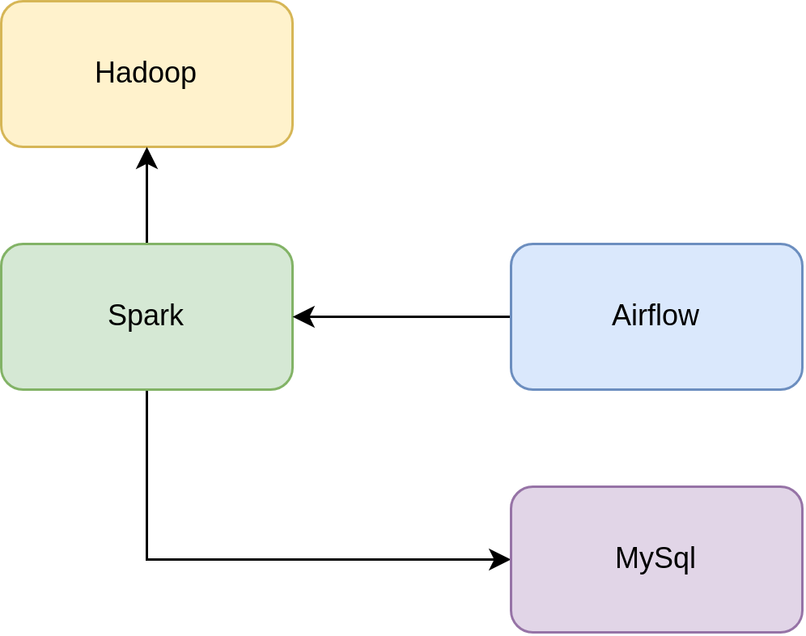

# Data Pipeline Project



## Setup Env
  ```
  sudo apt install python3-virtualenv
  virtualenv env -p python3.11 
  source env/bin/activate 
  pip install poetry
  ```

## Download binary

- Download Apache Hadoop:
<https://archive.apache.org/dist/hadoop/common/hadoop-3.3.6/hadoop-3.3.6.tar.gz>
- Download Apache Spark Binary <https://downloads.apache.org/spark/spark-3.3.6/>
- Put it to hadoop/

## Start and Stop Cluster
  ./run_cluster.sh
  ./stop_cluster.sh

## Update data

1. docker exec -it namenode bash
2. Make sure you have `logistic` directory in HDFS, if it's not exist just run this command `hadoop fs -mkdir -p logistic`
3. Put your data in `logistic` directory in your local project `hdfs dfs -put /hadoop-data/input/* logistic`


## Hadoop Configurations

1. core-site.xml default and description [here](https://hadoop.apache.org/docs/r3.3.6/hadoop-project-dist/hadoop-common/core-default.xml)
2. hdfs-site.xml default and description [here](https://hadoop.apache.org/docs/r3.3.6/hadoop-project-dist/hadoop-hdfs/hdfs-default.xml)
3. mapred-site.xml default and description [here](https://hadoop.apache.org/docs/r3.3.6/hadoop-mapreduce-client/hadoop-mapreduce-client-core/mapred-default.xml)
4. yarn-site.xml default and description [here](https://hadoop.apache.org/docs/r3.3.6/hadoop-yarn/hadoop-yarn-common/yarn-default.xml)
5. To calculate YARN and MapReduce memory configuration [here](https://docs.cloudera.com/HDPDocuments/HDP2/HDP-2.0.9.0/bk_installing_manually_book/content/rpm-chap1-11.html)


## Spark Connection 
  - Connection Id: spark_default
  - Connection Type: Spark
  - Port: 7077
  - Host: spark://spark-master
  - Extra: {"queue": "root.default"}

## Test Spark Submit
    http://localhost:9090/

    docker cp -L spark/apps/sale_average_price.py spark-master:/opt/spark-3.5.1/
    docker cp -L spark/apps/booking_analyze_sale.py spark-master:/opt/spark-3.5.1/
    docker cp -L spark/apps/booking_analyze_driver.py spark-master:/opt/spark-3.5.1/
    docker exec spark-master spark-submit --master spark://0.0.0.0:7077 average_price.py
    docker exec spark-master spark-submit --master spark://0.0.0.0:7077 booking_analyze_sale.py
  
    docker exec spark-master spark-submit --master spark://0.0.0.0:7077 booking_analyze_driver.py


## Access MySQL
    docker exec -it mysql_db bash
    mysql -u root -p
    u123FJf5dhRMa21


## Access Airflow
    User: airflow
    Pass: airflow


## Access Superset
    User: admin
    Pass: admin


## References
  - http://www.sefidian.com/2023/09/12/run-spark-submit-for-apache-spark-pyspark-using-docker/
